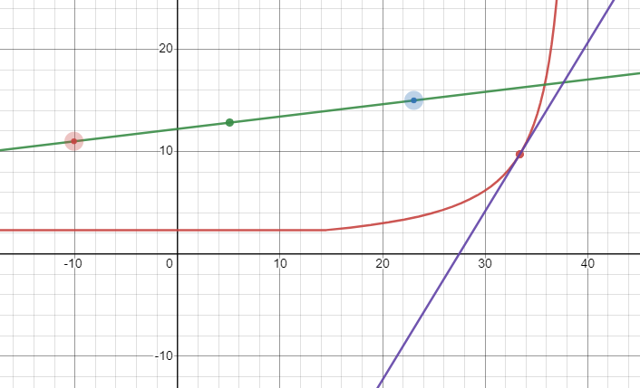

<h1>Progress</h1>

 <h2>Create a window</h2>

 

 <h2>Create effectors</h2>

 

 <h2>Mathematically model effector connection</h2>

 

 Our [effector connection model](https://www.desmos.com/calculator/eihh0v5kvx).

 <h2>Implement effector connection</h2>

 

 <h2>Mathematically model tension equation</h2>

 

 Our [tension model](https://www.desmos.com/calculator/dkrkf4jgrr).

 <h2>Implement tension equation</h2>

 

 <h2>Improve visuals</h2>

 

 [< return](../README.md)
 